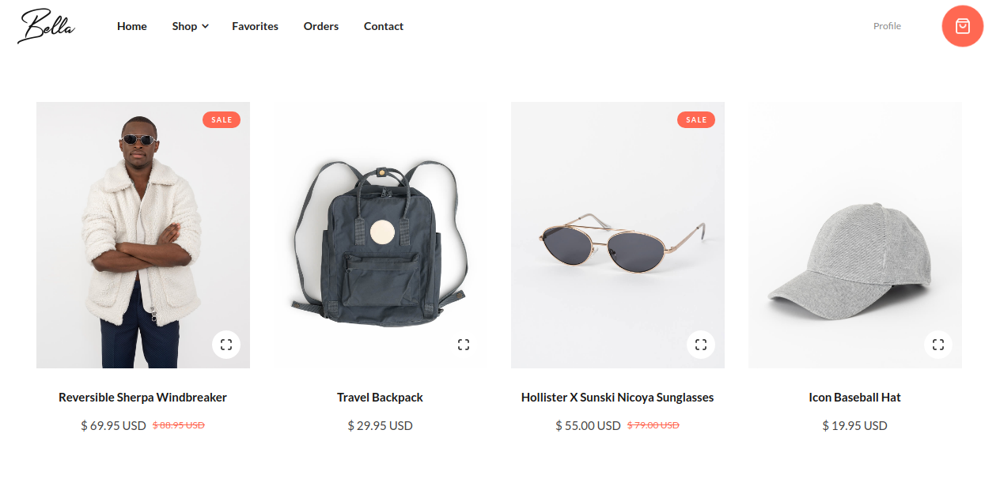
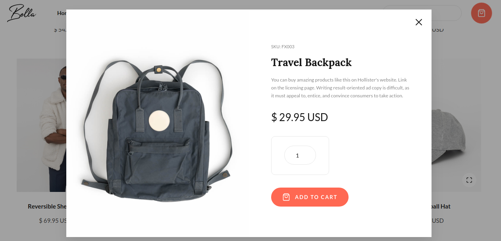

# react-assessment-test

<hr>

### Ecommerce Web-app

The goal of this assignment is to build a prototype Ecommerce website(React.js) / App(React Native).
This is just for reference you can make your own design with all these features. 

### When the app starts (Home Screen)



### Preview of a product



### Cart Screen


### Billing Form When an user wants to buy a product


The following pages have more details. Please read through the entire document for all the details.

<hr>

### Features

1. It is just like an ecommerce website/app.
2. We assume the following modules to be present
   1. Navigation
   2. Home Page
   3. Product Page
   4. Cart System
   5. Product/Order Placement Page
3. The **starting data** of this application can be assumed to come from a JSON file
4. As an example, A JSON file has been given to you. **You have to add minimum 10 data in the json provided.**
   1. product_lists.json
5. Each of the element in the JSON file represents a product
   1. **name**: The name of the product (string)
   2. **productId**: The Id of the product which can be assumed to be unique uid (string)
   3. **brandName**: brand of the product (string)
   4. **category**: category of the product (string)
   5. **companyAssured**: represents the company assured Product(boolean)
   6. **rating**: Average rating of the product (float)
   7. **price**: Final price of the product(float)
   8. **discount**: discount on a product (float) in %
   9. **imageURL**: image of a product
   10. **sellerName**: Name of the seller(string)
   11. **isNewProduct**:type of the product(boolean)
       `You should use all the elements provided in the json in your user-interface.`
6. It should have the following features

   1. When the app starts, the app loads the list of the products and displays the product with specified data.
   2. There can be number of navigations in the header/drawer. eg: **Home** , **My Favorites**,**My Cart** , **My Account**,etc.
   3. User can select one or more product.
   4. User can add the products to the cart system.
   5. User can see the selected products in the cart system.
   6. User can remove the product from the cart.
   7. User can see a brief preview before clicking on the product.
   8. User can buy a product.
   9. When an user go for buying a product, he/she will get a form in which he/she should must fill the mandatory fields like **Name**,**email**,**Phone Number**,**Address**,**Pincode**,etc.
   10. After filling the form, user will get a message for successful order placement.
   11. User can flag a product as a favorite.
   12. User can able to see his/her favorites product inside the **My Favorites section**.

7. **Fork** current problem repository. and make your forked repository **private**.
8. Add `@divyansh420` as collaborator while intializing repository in github. and follow the given timeline instructions from your mail.
9. Brownie points to deployed webapps(If you can, but not mandatory).
10. **React** Native candidates **MUST** submit the debug apk. 

<hr>

### Coding Guidelines

- You will be evaluated on the **Working Prototype** of the app with the following:
  - UI & design
  - Modularity of Code
  - Data Structures used
  - Logic and cleanliness of code.
  - Completeness.

<hr>

> product_lists.json

```json
[
  {
    "name": "EUROLINE 810 POP UP 700 W Pop Up Toaster  (White)",
    "productId": "EURO19938201",
    "brandName": "EUROLINE",
    "category": "Pop Up Toasters",
    "companyAssured": false,
    "rating": "4.2",
    "price": "12232",
    "discount": "50%",
    "imageURL": "https://rukminim1.flixcart.com/image/416/416/k5lcvbk0/pop-up-toaster/2/j/w/euroline-820-pop-up-810-pop-up-original-imafz8h3duveqgh7.jpeg?q=70",
    "sellerName": "telform inc.",
    "isNewProduct": true
  },
  {
    "name": "Morphy Richards 25 L Convection Microwave Oven  (MWO 25CG, Steel)",
    "productId": "EURO19938202",
    "brandName": "Morphy",
    "category": "Microwave Ovens",
    "companyAssured": true,
    "rating": "3.9",
    "price": "10999",
    "discount": "11%",
    "imageURL": "https://rukminim1.flixcart.com/image/416/416/microwave-new/v/q/y/morphy-richard-25cg-original-imaec2ddymudmze3.jpeg?q=70",
    "sellerName": "Kwitch Retails",
    "isNewProduct": false
  }
]
```
